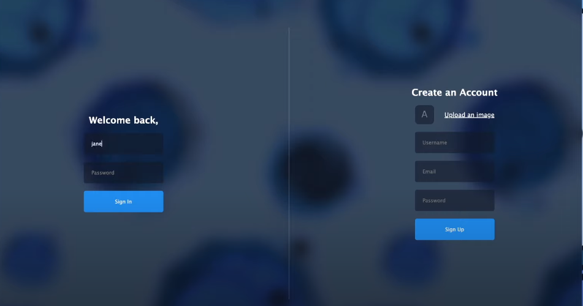
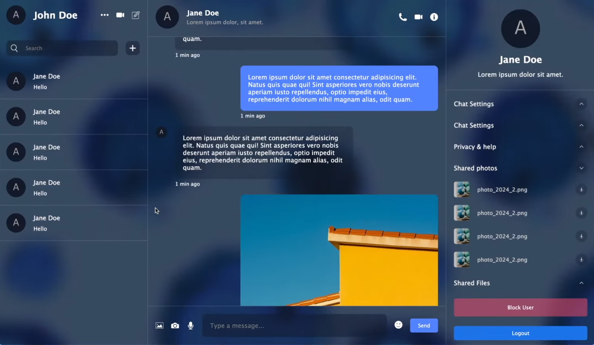
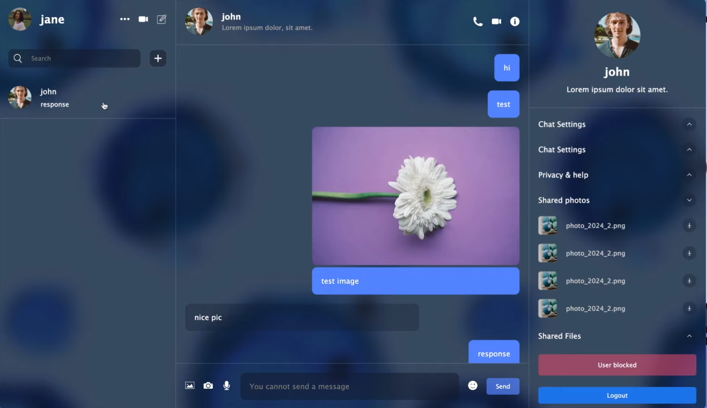

# React Chat App with Firebase
This is a simple real-time chat application built using React.js and Firebase Realtime Database.

## Features
Real-time Messaging: Messages are instantly synced across all clients in real-time.
Authentication: Users can sign up and log in securely using Firebase Authentication.

## Technologies Used
React.js
Firebase (Realtime Database, Authentication)
HTML/CSS

## Snaps of ui

